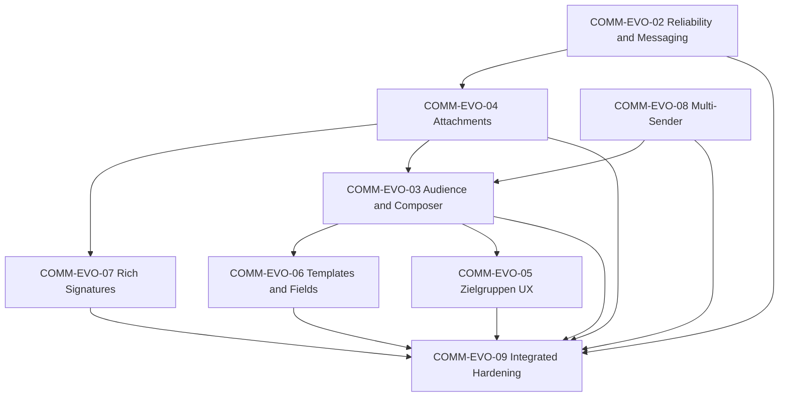

# SCE-COMM-EVO-01 — Communication Product Completion (Architecture & Gap Diagnosis)

**Mode:** Diagnosis + architecture only (no large feature implementation).  
**Supersedes:** Starting SCE-COMM-RELEASE-01 until EVO packages close material gaps.  
**STAGE baseline:** `443e0b76f9ca1d74d0c7a2230705741935806329`

---

## 1. Manual acceptance findings (confirmed STAGE feedback)

| Area | Current STAGE behaviour | Product gap |
|------|-------------------------|-------------|
| **Kommunikationscenter — list** | Real conversations load | OK |
| **Kommunikationscenter — detail** | Some selections → *Die Konversation konnte nicht geladen werden.* | **Release blocker** |
| **Ansicht (INBOX-02)** | Menu renders; layout/density choices often appear to do nothing | **High priority defect** |
| **Neue Nachricht** | Person search + fan-out direct threads | No org/unit/team/Zielgruppe/role audience composer |
| **Attachments** | Domain + storage exist; limited composer/inbox UX | Upload/preview/download not product-complete across surfaces |
| **Zielgruppen** | Canonical `CommunicationAudienceSpec` + sparse editor | Needs visual builder, preview, mobile UX |
| **Vorlagen** | Template copy without merge fields | No controlled field registry / server render |
| **Persönliche Signatur** | Plain text only (`UserCommunicationPersonalSignature.bodyText`) | Rich formatted signature + optional logo |
| **E-Mail-Absender** | Single tenant sender + platform fallback (`Tenant.emailSender*`) | 1–N sender identities, composer selection, history snapshot |

---

## 2. Root-cause diagnosis

### 2.1 INBOX detail load failure (P0)

**Failure path (client):**

1. List row click → `selectedId` in `CommunicationInboxWorkspace.tsx`
2. `GET /api/communication/inbox/conversations/[conversationId]`
3. On non-OK, empty `conversation`, or network error → `detailError` = *Die Konversation konnte nicht geladen werden.*

**Failure path (server — evidenced):**

- Route returns **raw Prisma** graph from `getCommunicationCenterConversationDetail()` with no DTO mapper (`app/api/communication/inbox/conversations/[conversationId]/route.ts`).
- Imported **EMAIL** messages persist `CommunicationCenterMessage.imapUid` and `uidValidity` as **`BigInt`** (`prisma/schema.prisma`).
- `NextResponse.json({ conversation })` uses `JSON.stringify`, which **throws** on `BigInt` → HTTP **500** → client shows the same error string as 404.

**EMAIL vs SCE-native:**

| Channel | Typical `imapUid` / `uidValidity` | Detail GET JSON |
|---------|-------------------------------------|-----------------|
| `EMAIL` (IMAP ingestion) | Populated (`ingestion-service.ts`) | **Fails serialization** |
| `SCE` (direct / platform) | Usually `null` | Often succeeds |

List endpoint does not embed full message rows with BigInt fields (only lightweight inbound preview), so **list can succeed while detail fails** for the same conversation.

**Not primary causes (same code path otherwise):**

- Authorization: list and detail share equivalent tenant + channel OR participant scope in `conversation-service.ts`.
- Sanitization: failure occurs before UI render; not a sanitizer defect.

**Fix direction (COMM-EVO-02):**

- Introduce `mapCommunicationCenterConversationDetailForClient()` (name per repo conventions) that:
  - Strips or stringifies non-JSON fields (`BigInt`, internal provider keys if needed).
  - Returns stable shape matching `InboxConversationDetail` / message DTO (`bodyHtmlSanitized`, timestamps as ISO strings).
- Unit + route tests: EMAIL fixture with BigInt must serialize.
- Optional: integration test on GET handler.

**Automated repro:** `lib/communication/inbox/__tests__/sce-comm-evo-01-inbox-detail-serialization.test.ts` (fails until DTO mapper wired in route).

---

### 2.2 Ansicht / workspace layout (P0/P1)

**Symptom:** User changes *Ansicht* or *Dichte*; workspace looks unchanged.

**Root causes (multiple, evidence-based):**

1. **Client layout change keeps old split % (product bug)**  
   - `useCommunicationInboxWorkspacePreferences.setLayout` sends `{ layout, listSplitPercent: previous }` on preset change unless `resetSplit: true` (only when re-selecting the **same** preset in `CommunicationInboxViewControl.tsx`).  
   - Server `saveCommunicationInboxWorkspacePreference` **would** apply `defaultListSplitPercentForLayout` when `listSplitPercent` omitted — but client always sends the old value.  
   - Result: `STANDARD` ↔ `READING_LARGE` ↔ `LIST_LARGE` can look nearly identical on wide screens.

2. **Stale GET overwrites optimistic layout (race)**  
   - Mount effect loads `/api/communication/inbox/workspace-preferences` asynchronously with no revision guard.  
   - User selects a new layout before GET completes → GET response resets to server/default preference.

3. **Viewport & selection context**  
   - Below `lg` (1024px), `CommunicationInboxWorkspaceLayout` forces master–detail; split presets collapse.  
   - `FULL_READING` / `LIST_ONLY` without a selected conversation both show **list only** — indistinguishable from default until user selects a thread.

4. **Remote schema (STAGE ops)**  
   - If `UserCommunicationInboxWorkspacePref` migration not applied, PUT fails (error only in `sr-only` status) — persistence broken; local cache may flash then revert on reload.

**Fix direction (COMM-EVO-02):**

- On layout preset change: always apply `defaultListSplitPercentForLayout(layout)` unless user has manually resized (track `splitTouched` flag).
- Align client PUT body with server semantics (omit `listSplitPercent` on preset change, or send explicit default).
- Guard preference hydration: ignore stale GET if `hasStoredPreference` or monotonic `updatedAt`/request id.
- Visible persist error in toolbar (not `sr-only` only).
- Document acceptance: verify layout change at `≥1024px` width **with conversation selected** for master–detail modes.

**Automated repro:** `lib/communication/__tests__/sce-comm-evo-01-inbox-view-defect.test.ts` (fails on split + race contracts).

---

## 3. Communication Center — message engine audit (COMM-15 + UX)

**Canonical workspace:** Kommunikationscenter remains the single inbox/conversation UI; no parallel email engine.

| Capability | Status | Notes |
|------------|--------|-------|
| Receive email (IMAP) | **Exists** | `sync-service`, `ingestion-service`, encrypted mailbox creds |
| Read full email | **Partial** | Data in DB; detail API broken for EMAIL (BigInt) |
| Reply | **Exists** | `reply-service`, permission-gated, inform-only lock |
| Outbound compose | **Partial** | Reply + direct message; no full “new email to arbitrary address” product |
| Threading | **Exists** | `threadRootMessageId`, Message-ID / subject fallback |
| Identities | **Partial** | From on inbound/outbound messages; single tenant sender for outbound |
| To / Cc | **Partial** | Stored as JSON on messages; Cc not exposed in reply UI |
| Attachments | **Partial** | Ingestion creates `CommunicationAttachment` + links; download UX incomplete |
| Inline images | **Partial** | Sanitized HTML + `remoteImagesBlocked` |
| Timestamps / direction / delivery | **Exists** | Enums on `CommunicationCenterMessage` |
| Read state / assignment / archive / star / trash | **Exists** | COMM-INBOX-01 + readStates |
| Search | **Exists** | `searchText` on conversation |
| Safe HTML + plain fallback | **Exists** | `bodyHtmlSanitized`, `bodyText` |

**Missing for production-grade product:** JSON-safe detail API, attachment download in timeline, Cc policy, multi-sender From on reply, outbound compose parity, consistent DTO layer for client.

---

## 4. Attachment architecture

**Canonical storage (already in repo — do not duplicate):**

- **`CommunicationAttachment`** — tenant-owned metadata; binary in **private Workspace blob store** via `attachment-storage.ts` (not Postgres bytes).
- Validation: `attachment-validation.ts` (MIME allowlist, size caps, count limits).
- Links: `CommunicationCenterMessageAttachment`, `PlatformCommunicationAttachment`, `CommunicationMessageAttachment`.
- Workspace document/version optional provenance (`sourceDocumentId`, `sourceDocumentVersionId`).
- Lifecycle: `STAGED` → scan seam (`scanStatus`) → delivery gates in workspace malware policy.

**Target `CommunicationAttachment` usage matrix:**

| Owner surface | Link model | Notes |
|---------------|------------|-------|
| Communication Center message | `CommunicationCenterMessageAttachment` | Inbound IMAP + outbound reply |
| Direct / Mitteilung / Kampagne | `PlatformCommunicationAttachment` + publish snapshots | Freeze at publish where required |
| Legacy team chat message | `CommunicationMessageAttachment` | COMM-05 path |
| Signature logo (future) | New link or workspace private asset reference | Must not use public blob URLs |

**Security (retain + extend):**

- Tenant isolation on every read stream (`attachment-service.ts` + auth).
- `Content-Disposition: attachment` / safe inline for images only after scan + MIME check.
- No executable HTML/SVG-by-default in comm bodies; attachments nosniff.
- Malware scanning seam aligned with Workspace (`scanStatus`).

**EVO-04 scope:** Composer staging APIs, bind on send/publish, inbox timeline chips, download route reuse, inline image `content-id` metadata if email requires.

---

## 5. Universal audience composer

**Canonical model:** `CommunicationAudienceSpec` (`zielgruppe-definition.ts`) + `resolveCommunicationRecipientsForDispatch` (COMM-03).

**Current surfaces:**

| Surface | Audience input |
|---------|----------------|
| Neue Nachricht | `recipientPersonIds[]` only (`DirectMessageComposer`, `direct-message-service`) |
| Mitteilung / Kampagne | Full `CommunicationAudienceSpec` in platform communications |
| Team presets | Structural selectors mapped to spec |

**Privacy semantics (direct MESSAGE — keep):**

- Multi-recipient send creates **one private SCE thread per recipient** (`direct-message-service.ts` comment + fan-out) — **not** one shared group thread.
- **INFORM** → `repliesAllowed: false` server-side.

**Target semantics:**

| Selector | Resolution | Reply thread |
|----------|------------|--------------|
| Whole organisation | Tenant-wide eligible persons | Per-person threads or broadcast inform (no cross-recipient visibility) |
| OrgUnit / Team | Structural selectors in spec | Same fan-out for MESSAGE |
| Zielgruppe | `savedTargetGroupIds` | Snapshot at send/publish per COMM-16 rules |
| Role | Dynamic rule / role keys in spec | Resolver must be deterministic |
| Person | Explicit IDs | Existing path |

**Design:** One shared **AudienceSelector** component (COMM-EVO-03) backed by spec validation; surfaces enable subsets (e.g. direct message may hide sponsor selectors).

**Open decision:** Allow `CommunicationAudienceSpec` on direct send API with mandatory fan-out + inform/message mode — replaces person-only search while preserving privacy.

---

## 6. Sender identity architecture (1–N)

**Current:**

- `Tenant.emailSenderDisplayName` / `emailSenderAddress` + `resolveTenantEmailSender()` (`email-sender-service.ts`).
- Platform fallback via `EMAIL_FROM`.
- Provider verification via Resend domain readiness (not user-editable truth).

**Target model (proposed name): `TenantCommunicationSenderIdentity`**

| Field | Purpose |
|-------|---------|
| `tenantId` | Isolation |
| `displayName`, `emailAddress` | From header |
| `verificationStatus` / `readiness` | Mirror platform email readiness evaluation |
| `isDefault`, `isActive` | Selection rules |
| `scopeJson?` | Optional org unit / team restriction |
| `allowedRoleKeys?` | Who may select in composer |
| Audit timestamps, `createdByUserId` | Governance |

**Historical snapshot:**

- On publish/send: copy effective From (+ optional Reply-To) onto `PlatformCommunication` / message rows (pattern like existing publish snapshots).
- Billing transport unchanged.

**Reply-To:** Separate optional field per identity; inbox reply threads use conversation channel context.

**Migration (EVO-08 — design only here):**

- Seed one identity from existing `Tenant.emailSender*`; keep reading legacy columns during transition; deprecate after cutover.

---

## 7. Template personalisation

**Current:** `PlatformCommunicationTemplate` stores subject/body/audience JSON — **no merge field engine**.

**Target: merge field registry (server-only render)**

| Field key | Label (DE) | Source | Ambiguity |
|-----------|------------|--------|-----------|
| `person.first_name` | Vorname | `Person.firstName` | Low |
| `person.last_name` | Nachname | `Person.lastName` | Low |
| `person.display_name` | Anzeigename | `Person.displayName` \|\| composed | Low |
| `organisation.name` | Vereinsname | `Tenant.name` | Low |
| `season.label` | Saison | Active season for tenant | Medium — define “active” |
| `team.active_season` | Team (aktive Saison) | Membership in active season | **High** — require rule: primary team, or **unavailable** token |

**Syntax:** Prefer `{{person.first_name}}` or `<first_name>` — pick one in EVO-06; UI “Feld einfügen” inserts canonical token.

**Rules:**

- Server-side render per recipient at publish/send; freeze rendered body in delivery snapshot.
- Missing values → configurable fallback (empty or German placeholder).
- Escape HTML in email; no JS/expressions.
- Preview uses sample recipient from audience preview API.

---

## 8. Rich personal signature

**Current (COMM-UX-08A):** Plain text `bodyText`, strip all HTML tags on save.

**Target:**

- Structured document (e.g. JSON blocks: paragraph, bold, link, image) or limited markdown → sanitize → HTML for email; plain derivative for push.
- Logo via **Workspace private storage** or staged `CommunicationAttachment` owned by user preference row.
- Backward compatible: existing plain signatures render as single text block.

---

## 9. Zielgruppen UX rebuild (domain unchanged)

Keep `TargetGroup` + `CommunicationAudienceSpec` v2 rule JSON.

**Target builder (COMM-EVO-05):**

- Header + “Wer soll diese Zielgruppe erhalten?”
- Include cards: OrgUnit, Team, Role, Person (+ saved groups).
- Exclude cards: same set.
- Combination: ODER / UND → maps to `composition` + components.
- Human-readable summary (`rule-mapper` / new summary service).
- Preview panel: count, sample list, refresh.
- Archive/delete de-emphasised in editor chrome; mobile stacked layout.

---

## 10. Shared composer UX (target)

| Step | Content |
|------|---------|
| 1 Inhalt | Subject, body, template tokens |
| 2 Empfänger | Universal audience selector + count preview |
| 3 Absender & Kanäle | Sender identity, channel intent, reply mode |
| 4 Anhänge / Optionen | Staged attachments, signature toggle |
| 5 Überprüfen | From, Reply-To, audience summary, attachments, schedule |

Direct message may merge steps 2–3; inbox reply stays lightweight but gains attachments + sender display.

---

## 11. Defect priorities

| Priority | Item |
|----------|------|
| **P0** | Conversation detail GET fails for EMAIL (BigInt JSON) |
| **P0/P1** | Ansicht layout/split not applied + preference hydration race |
| **P1** | Universal audience on Neue Nachricht / Mitteilung / Kampagne parity |
| **P1** | Attachment UX on all send/receive surfaces |
| **P1** | Multi-sender identities + composer selection |
| **P1** | Template merge fields + server render |
| **P2** | Rich signatures |
| **P2** | Zielgruppen visual builder polish |
| **P2** | Cc in reply, advanced search |

---

## 12. Migration / release risk (COMM-16 / 17 / 18)

| Migration | Purpose |
|-----------|---------|
| `20260927300000_sce_comm_16_templates_scheduling` | Templates + publication schedules |
| `20260927310000_sce_comm_17_preferences_consent` | Communication preferences |
| `20260927320000_sce_comm_18_youth_guardian_safeguarding` | Youth/guardian safeguards |
| `20260928140000_sce_comm_inbox_02_workspace_pref` | Inbox Ansicht preferences |

**This package:** No remote migration recovery performed.

**RELEASE-01 still required:** Reconcile **actual remote DB migration state** on production/staging before operational release (historical COMM release concern unchanged).

---

## 13. Implementation package plan

| Package | Scope |
|---------|--------|
| **COMM-EVO-02** | Detail DTO + BigInt fix, Ansicht split/hydration, inbox attachment display/download, hardening tests |
| **COMM-EVO-03** | Universal audience selector, direct send spec integration, shared composer shell |
| **COMM-EVO-04** | Staging/upload/download across comm surfaces (reuse Workspace storage) |
| **COMM-EVO-05** | Zielgruppen visual builder + preview |
| **COMM-EVO-06** | Merge field registry + server render + Vorlagen UI |
| **COMM-EVO-07** | Rich signature model + email/in-app render |
| **COMM-EVO-08** | Sender identity model + migration design + admin UI |
| **COMM-EVO-09** | Cross-cutting QA, RELEASE-01 migration checklist, analytics seams |

---

## 14. Release blockers (summary)

1. Inbox conversation detail cannot load for typical imported email rows (500 / BigInt).
2. Inbox Ansicht preferences do not reliably change layout (split + race + UX feedback).
3. Product gaps A–H above block “coherent production-grade messaging” acceptance.

---

## 15. Validation performed (EVO-01)

Commands run on branch `cursor/comm-evo-01-product-completion-architecture`:

- `npx prisma validate`
- `npx prisma generate`
- Targeted Communication / inbox tests (including new EVO-01 defect tests)
- ESLint on changed files
- `APPLY_DATABASE_MIGRATIONS=false npm run build`

No remote writes, migrations, email, push, or IMAP sync.

---

## 16. References

- `SCE-COMM-UX-03R2-READING-PANE-DEFECT.md` — prior client placeholder defect (fixed); distinct from BigInt API failure.
- `SCE-COMM-INBOX-02-FLEXIBLE-INBOX-VIEWS.md` — layout product spec.
- `SCE-COMM-15-COMMUNICATION-CENTER-INBOUND-EMAIL.md` — inbound engine.
- `SCE-COMM-03-RECIPIENT-RESOLUTION.md` — audience resolution.
